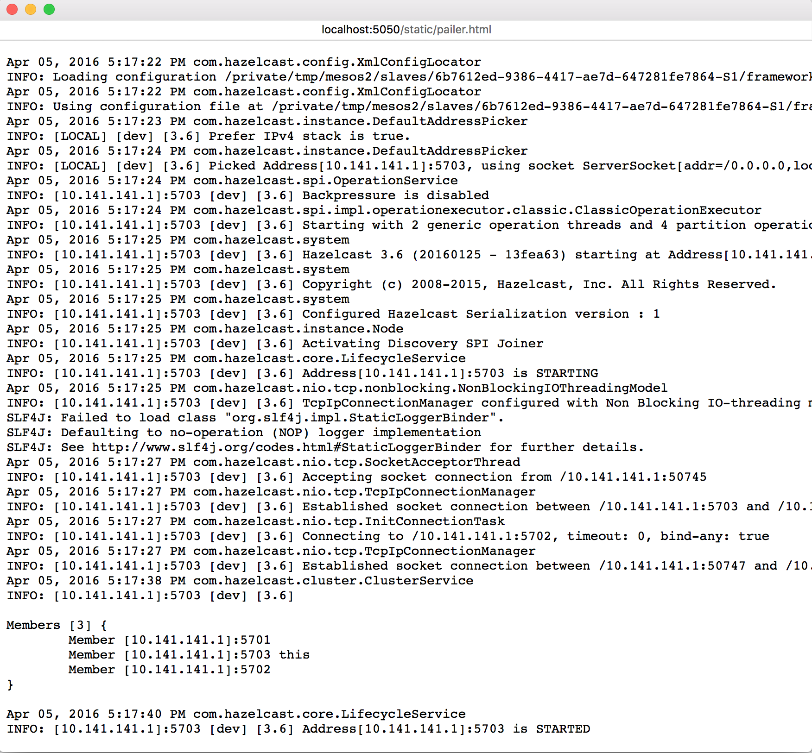

---
**REMARK**

Dear community members,

Thanks for your interest in **hazelcast-mesos**! As of June 2021, this project has become a Hazelcast Community project.

Hazelcast Inc. gives this project to the developers community in the hope you can benefit from it. It comes without any maintenance guarantee by the original developers but their goodwill (and time!). We encourage you to use this project however you see fit, including any type of contribution in the form of a pull request or an issue. 

Feel free to visit our Slack Community for any help and feedback.

---

# Hazelcast Mesos

This module gives you the ability to deploy Hazelcast on the Mesos cluster.

## Warning
This is an early version of Hazelcast Mesos integration. Anything in this project may change without notice and/or break older installations.

## Prerequisites

- A running Mesos cluster to deploy Hazelcast on it. For information on installing and running Apache Mesos, please refer to http://mesos.apache.org/gettingstarted/.
- Java needs to be installed and configured on the Mesos slaves.

## Running Hazelcast Mesos via Command Line

You can deploy Hazelcast on Mesos via command line by running the Hazelcast Scheduler. Please perform the following steps:

- Download the Hazelcast Mesos package from `https://s3.amazonaws.com/hazelcast/mesos/hazelcast-mesos-0.1.tar.gz`.
- Extract the archive:

```bash
tar -zxvf hazelcast-mesos-0.1.tar.gz
```
- Navigate to `hazelcast-mesos-0.1`:

```bash
cd hazelcast-mesos-0.1
```
- Open the `start.sh` in the text editor and edit the configuration parameters according to your needs:

```bash
#!/usr/bin/env bash

export HAZELCAST_VERSION=3.6
export HOST="localhost"
export PORT="8090"
export MESOS_ZK="zk://localhost:2181/mesos"
export MIN_HEAP="1g"
export MAX_HEAP="1g"
export CPU_PER_NODE=1.0
export MEMORY_PER_NODE=1024.0
export NUMBER_OF_NODES=1

java -cp hazelcast-mesos-scheduler.jar HazelcastMain
```
- Run the scheduler:

```bash
sh start.sh
```
- Open the Mesos UI at `http://localhost:5050`. You should see the Hazelcast tasks with state `RUNNING` .


The scheduler will pull the Hazelcast binaries from web and distribute it to Mesos slaves and start the Hazelcast nodes. **Hazelcast Scheduler will place only one Hazelcast member per Mesos slave.**

You can control the cluster size of Hazelcast via the REST API it provides.
For example, to scale Hazelcast cluster to 5 nodes, run the following command:

```bash
curl -X POST http://localhost:8090/nodes?nodeCount=5
```

## Running Hazelcast Mesos via Marathon

You can deploy Hazelcast on Mesos via Marathon.

For information on installing Marathon, please refer to https://docs.mesosphere.com/getting-started/datacenter/install/.

After you install Marathon, please perform the following steps:

- Save the following JSON as `hazelcast.json`:

```json
{
  "id": "/hazelcast",
  "instances": 1,
  "cpus": 1,
  "mem": 1024,
  "ports": [
    0
  ],
  "env": {
    "HAZELCAST_VERSION": "3.6",
    "HOST": "localhost",
    "PORT": "8090",
    "MESOS_ZK": "zk://localhost:2181/mesos",
    "MIN_HEAP": "1g",
    "MAX_HEAP": "1g",
    "CPU_PER_NODE": "1.0",
    "MEMORY_PER_NODE": "1024.0",
    "NUMBER_OF_NODES": "3"
  },
  "cmd": "cd hazelcast-mesos-0.1 && java -cp hazelcast-mesos-scheduler.jar HazelcastMain",
  "uris": [
    "https://s3.amazonaws.com/hazelcast/mesos/hazelcast-mesos-0.1.tar.gz"
  ]
}
```
- Initiate a POST request to Marathon REST API:

```bash
curl -X POST http://localhost:8080/v2/apps -d @hazelcast.json -H "Content-type: application/json"
```
- Open the Marathon UI at `http://localhost:8080`. You should see the `hazelcast` application with state `Running`:


- Open the Mesos UI at `http://localhost:5050`. You should see the Hazelcast tasks with state `RUNNING`:


- Click the `Sandbox` link to see the working directory of task:


- You can have a look at the logs of Hazelcast by clicking on the `hazelcast.log` or `hazelcast.err.log` links.



## Configuration

You can pass environment variables to configure Hazelcast Mesos integration. You can pass those environment variables either in the Marathon recipe or in the `start.sh`.

| Variable Name  | Default Value   | Description   |
|---|---|---|
| HAZELCAST_VERSION  |  3.6  |  To be deployed distribution version of hazelcast.  |
| HOST  | localhost   | Internal web server host which Hazelcast Scheduler uses for file distribution to Mesos Slaves.  |   
| PORT  | 8090 | Internal web server port which Hazelcast Scheduler uses for file distribution to Mesos Slaves.  |
| MESOS_ZK | zk://localhost:2181/mesos | ZooKeeper address which Mesos Master uses for coordination |
| MIN_HEAP | 1g | Java minimum heap size for the JVM which Hazelcast instance lives on the Mesos Slave.|  
| MAX_HEAP | 1g | Java maximum heap size for the JVM which Hazelcast instance lives on the Mesos Slave. |
| CPU_PER_NODE | 1.0 | Number of CPU units to be used for each Hazelcast instance deployment on the Mesos Slaves. |
| MEMORY_PER_NODE | 1024.0 | Amount of Memory units to be used for each Hazelcast instance deployment on the Mesos Slaves. |   
| NUMBER_OF_NODES | 1 | Size of the Hazelcast cluster.|    
